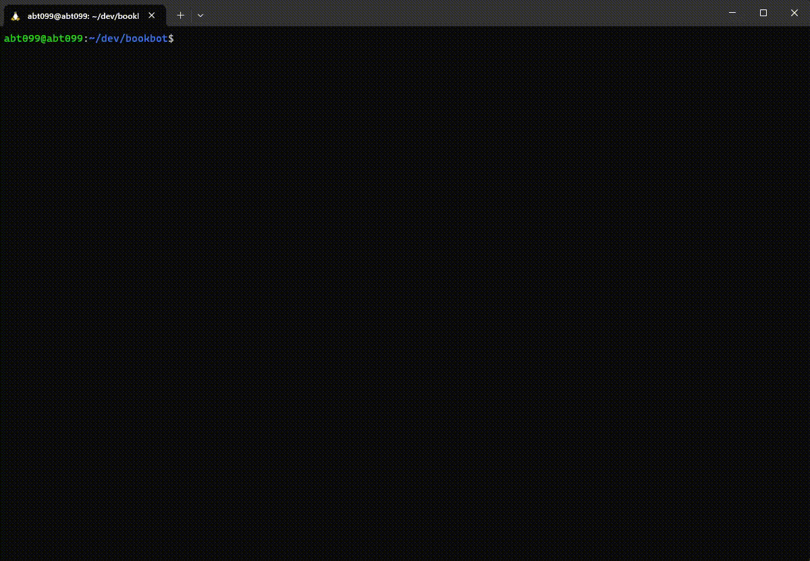

# bookbot

a Python program that analyzes novels and prints a statistical report of the word and character usage found within.

## Demo



## Installation

1. Clone this repository:

```bash
git clone https://github.com/ABT099/bookbot.git
cd bookbot
```

2. Make sure you have Python 3.x installed on your system.

## Usage

Run BookBot from the command line by providing a path to your text file:

```bash
python3 main.py path/to/your/book.txt
```
